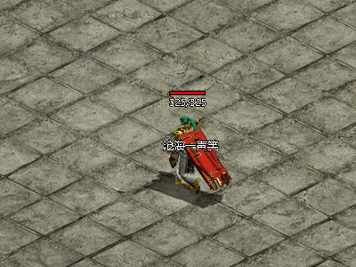

# Simple 2D Render Engine on Windows(using DirectX11)

一个简单的2D渲染引擎，基于DX11。和Cocos2d 相似的API，用于学习2D游戏开发。 

## ## 由来

​        2018年的时候在网上无意中发现了《传奇世界》客户端的资源导出工具，瞬间点燃了心中那个梦，想实现自己的传奇世界客户端以及服务器。最开始用的cocos2dx，但是有两个致命缺点

* cocos2dx 的CPU资源占用过高
* cocos2dx的文字渲染方案在做这种复古游戏时(字很小)失真很大，即使缩放后也依旧

加上抱着学习的目的，自己来实现一个简单的游戏引擎，图形使用DirectX11，字体方案采用Direct2D，最终初有成效。奈何原版地图资源我找不到方法破解和导出，所以项目暂停了。

放一张开发中的图留作纪念，永远的道士:

也用其做过一些PPT：

